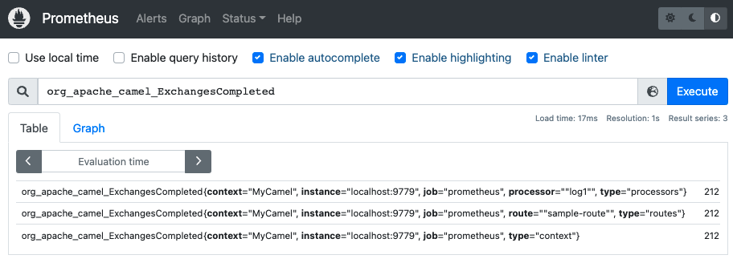
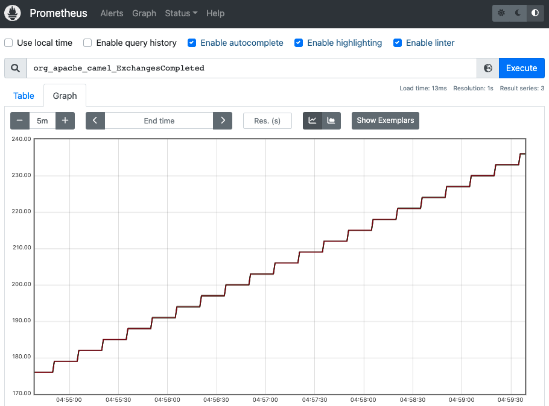
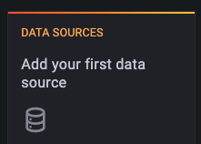
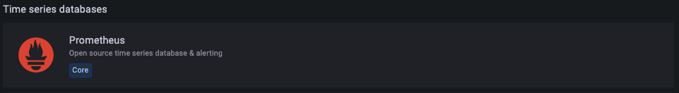
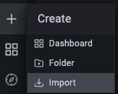
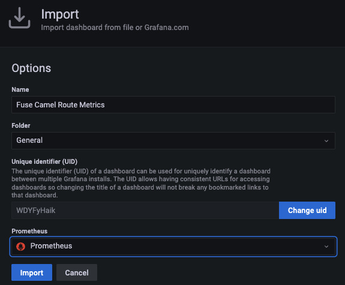
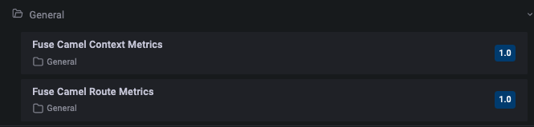
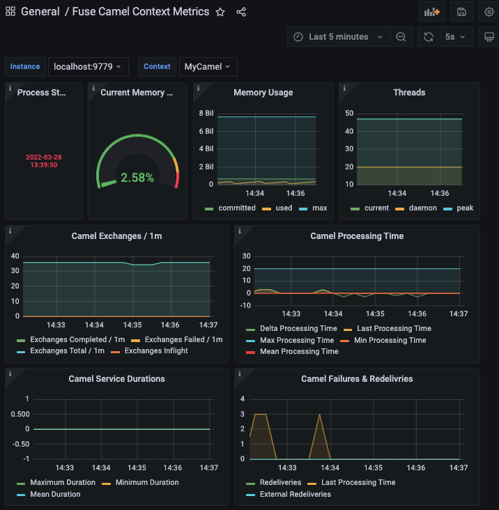
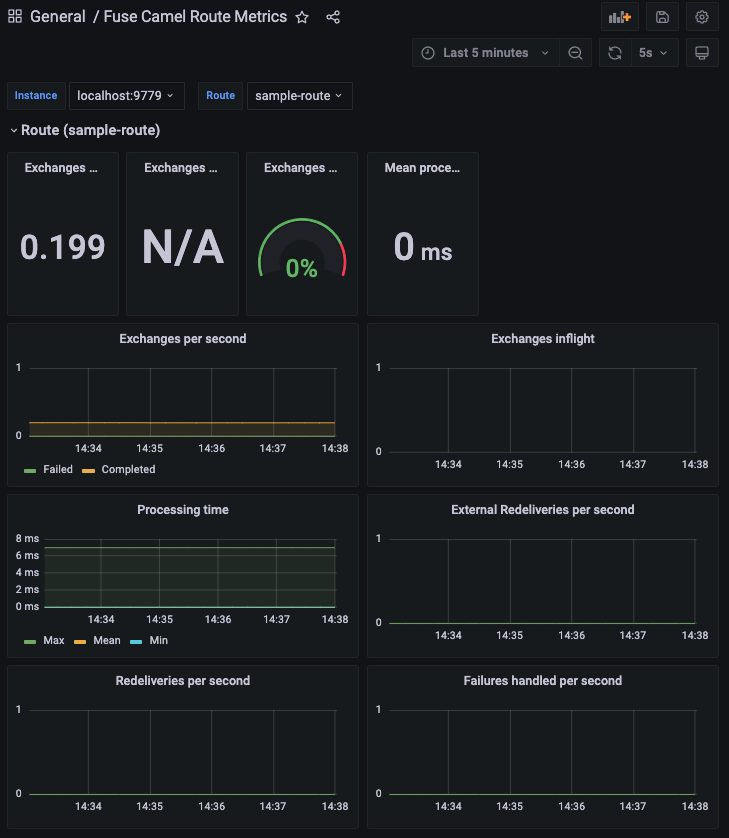

# fuse-prometheus-demo

This demo shows how to use `jmx-exporter` to expose prometheus metrics for monitoring.

The camel route `sample-route` in this demo is very simple, just log message every 5 seconds.
```xml
<route id="sample-route">
  <from uri="timer:demo?period=5s" />
  <log message="timer fired at ${header.CamelTimerFiredTime}"/>
</route>
```

## Build and Run

You will need to compile this demo first:
```sh
mvn install
```

Run the demo:
```sh
java -javaagent:./prometheus/jmx_prometheus_javaagent.jar=9779:./prometheus/prometheus-config.yml -jar target/fuse-prometheus-demo-1.0-SNAPSHOT.jar
```

By running above command, prometheus metrics is automatically exposed to http://localhost:9779/metrics .

From a web browser you can access metrics using the following link(s):

    http://localhost:9779/metrics

Part of output is shown as,
```
# HELP jmx_config_reload_success_total Number of times configuration have successfully been reloaded.
# TYPE jmx_config_reload_success_total counter
jmx_config_reload_success_total 0.0
# HELP jmx_config_reload_failure_total Number of times configuration have failed to be reloaded.
# TYPE jmx_config_reload_failure_total counter
jmx_config_reload_failure_total 0.0
# HELP jvm_buffer_pool_used_bytes Used bytes of a given JVM buffer pool.
# TYPE jvm_buffer_pool_used_bytes gauge
jvm_buffer_pool_used_bytes{pool="direct",} 40920.0
```
## Configuration

`jmx-exporter` is Java Agent which can export JMX mBean to format of prometheus.
This Agent is configurated by [prometheus/prometheus-config.yml](prometheus/prometheus-config.yml). 
This config file is same as one used in **Fuse on OpenShift**. 

For specification of config yml, you can find detail at [here](https://github.com/prometheus/jmx_exporter).


## Demo 1: Access metrics from Prometheus

1. Download Prometheus from https://prometheus.io/download/
2. Extract and add Fuse server as static target
```sh
tar xvfz prometheus-*.tar.gz
cd prometheus-* 
vi prometheus.yml
```

BEFORE modify:
```yaml
static_configs:
   - targets: ["localhost:9090"]
```

AFTER modify (here we add `localhost:9779` to targets):
```yaml
static_configs:
  - targets: ["localhost:9090", "localhost:9779"]
```

3. Start prometheus
```sh
./prometheus --config.file=prometheus.yml
```

4. Access Prometheus Console
 
   http://localhost:9090/

5. In search inbox, type `org_apache_camel_ExchangesCompleted` and click "Execute"
   

6. Click "Graph" to have a graph view.
  


## Demo 2: Access metrics dashboard from Grafana

1. Download Prometheus from https://grafana.com/grafana/download?edition=oss
2. Extract and start grafana server
```sh
curl -O https://dl.grafana.com/oss/release/grafana-8.4.4.darwin-amd64.tar.gz
tar -zxvf grafana-8.4.4.darwin-amd64.tar.gz
cd grafana-8.4.4
./bin/grafana-server web
```
3. Login to Grafana
   
   http://locahost:3000

   > First time you login as admin (password: admin), you have to change password.

4. Setup Grafana with Prometheus

Start by adding your Prometheus data collection. Click `Data Source`.


select `Prometheus`.


Because our Prometheus server is exposed on port 9090, add url of prometheus as `http://localhost:9090`


Then, to import Grafana Dashboard, click [+] in left pannel and select `Import`.


Click `Upload JSON File` and select json file under `grafana-dashboard` one by one.
| JSON File  | Dashboard Name  |
|------------|-----------------|
| `grafana-dashboard/fuse-grafana-dashboard-routes-standalone.json`  | Fuse Camel Route Metrics  |
| `grafana-dashboard/fuse-grafana-dashboard-standalone.json` | Fuse Camel Context Metrics |




After you upload josn files, you can find 2 dashboards is ready for use. 


**Fuse Camel Context Metrics**


**Fuse Camel Route Metrics**
